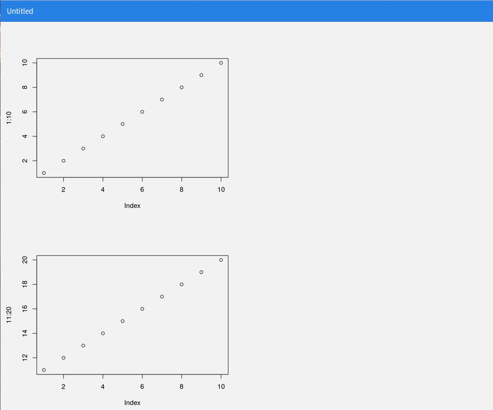

```{r setup, include=FALSE}
knitr::opts_chunk$set(eval = FALSE,
                      message = FALSE,
                      warning = FALSE)
library(webshot)
```


# はじめに

## 自己紹介 {.twocol}

### {.left}

- 前田 和寛
- 比治山大学短期大学部
- @kazutan
    - twitter
    - GitHub
    - Qiita
- [Kazutan.R](https://kazutan.github.io/kazutanR/)
- Rおじさん

### {.right}


## こんなことしてます


## 今日のお話

flexdashboardの本格入門

- 特徴と導入
- hello, dashboard!
- 全体設定(yaml部分)
- ダッシュボードレイアウト
- 構成要素
- 応用技
- Shinyの利用
- デプロイ(公開)
- 留意事項

# flaxdashboardとは

## rmarkdownでダッシュボード作成

- rmarkdownのテンプレートパッケージ
    - 単一のRmdファイルからダッシュボード生成
    - 基本的な作り方は一緒
- 単一ファイルで出力
    - `self_contained: true`でhtmlファイルにまとめられる
    - でもタブ機能やメニュー機能もある
- レイアウト調整・テーマ変更も簡単
    - cssを書かなくてもできる
    - テーマも色々ある

---

サンプルその1:


---

サンプルその2:


---

サンプルその3:


## インストール

- パッケージをインストール:

```{r}
# CRANから
install.packages("flexdashboard")
# GitHubから
remotes::install_github("rstudio/flexdashboard")
# githubinstallで
githubinstall::githubinstall("flexdashboard")
```

- 関連するパッケージはアップデートしておいてください:
    - rmarkdown
    - knitr(**v1.17では不具合**あり。**v1.17.20**以上推奨。)
    - htmlwidgets系パッケージ(使うなら)
    - shiny系パッケージ(使うなら)

# hello, dashboard!

## テンプレートから生成 {.twocol}

### {.left}

1. R Markdownを新規作成
1. **From Template**を選択
1. **Flex Dashboard**を選択
1. **OK**をクリック

### {.right}


## Rmdを素のままKnit {.twocol}

### {.left}

1. 右のようなRmdファイルが生成
1. まずはそのままKnit
    - "Rmds/fdb_base.Rmd" で今回は保存

### {.right}


## できた


## 表を差し込んでみよう

- **Save As...** で "Rmds/fdb_base1.Rmd"として保存
- ひとつ目のチャンクに以下のコードを記述
    - **irisの全レコードそのまま出させる**

```{r}
knitr::kable(mtcars)
```

---

こうなる:


## plotを差し込んでみよう

ふたつ目のチャンクにggplot2で描いてみる

```{r}
library(ggplot2)
ggplot(mtcars, aes(wt, mpg)) + geom_point()
```

みっつ目のチャンクにplotlyで描いてみる

```{r}
library(plotly)
plot_ly(data = mtcars, x = ~cyl, y =~mpg, type = "box")
```

---

こうなった:


# 全体設定(yaml部分)

## 基本

````
---
title: "ダッシュボードタイトル"
output:
  flexdashboard::flex_dashboard:
    (以下，設定項目)
---
````

- titleはウィンドウ左上にでます
- 記述方法はこれまでのR Markdownと同一です
- flexdashboard特有で，ポイントになるのを紹介
- 詳細な項目については，`?flexdashboard::flex_dashboard`のUsageを参照

## fig関連

- fig_mobile
    - モバイル(幅が小さい画面)用にfigをさらに作るかどうか
    - **true(デフォルト)**なら，モバイル用に作成
    - **false**なら，作成しない
    - 長さ2の数値ベクトルを与えると，その大きさでモバイル用figを作成
- fig_width, fig_height, fig_retina
    - 通常のrmarkdownと同一なので省略

## favicon, logo

- favicon
    - ダッシュボードに使うファビコン画像へのpathを指定
- logo
    - ダッシュボードのロゴとして使う画像へのpathを指定
    - ナビゲーションバー(navbar)で表示
    - ただし，**画像サイズは調整されない**ので注意
    - `theme: cosmo`(defaultと同値)だと48px

## theme {#fdb_theme}

- theme
    - ダッシュボードのテーマを指定
    - デフォルトは`default`で，これは`cosmo`と同値
    - 現在は，`default`, `bootstrap`, `cerulean`, `journal`, `flatly`, `readable`, `spacelab`, `united`, `cosmo`, `lumen`, `paper`, `sandstone`, `simplex`, `yeti`が使用可能
    - [bootswatch](https://bootswatch.com/)のをベースにしているので，一覧はそちらを参照

## ナビゲーションバー周辺

- nabvar
    - ナビゲーションバーに設置する項目に関して設定
    - 外部リンクや配置なども設定可能
    - 詳しくは[公式サイトの該当箇所](http://rmarkdown.rstudio.com/flexdashboard/using.html#navigation_bar)
- social
    - 要は**共有**のための要素
    - `social: menu`とするとTwitter, Facebook, Google+, LinkedIn, Pinterestが選べるように
    - `social: [ "twitter", "facebook", "menu" ]`を指定してみるとイメージつかめます

---

- source_code
    - このダッシュボードのソースコードへのpathを指定
    - 要は「コードを他の人にも見せたい」というときに、ここを使ってください
    - おそらくオープンな単発ダッシュボードで使うものだと思います

- あとは省略
    - レイアウトに関するところは次で
    - それ以外でrmarkdown標準のお話は避けます
    - 気になる方はヘルプを見てください


# ダッシュボードレイアウト

## 意識すべきは見出しレベル、そしてLv3まで

- flexdashboardはboxシステム
    - pandocの`--seciton-div`を利用し、jsやcssで区分けを実現
    - 要は`html_document`の魔改造と思っても間違いはない
- 以下、ポイントと解説をしていきます
    - 詳細は、公式サイトの以下のページを参照してください
    - [Sample flexdashboard Layouts](http://rmarkdown.rstudio.com/flexdashboard/layouts.html)

## 見出しレベル2: ページ内の親ブロック区切り {#lv2_heading}

- 見出しレベル2があると、その数だけページ内を区切ります
    - 公式やサンプルでは`---`を使った方法で解説
    ```
    ブロック名
    ---
    ```
    - でもいつもの`##`でもOK
    ```
    ## ブロック名
    ```
    - ブロック名のあとに、必要に応じて属性を付与(後述)
- この見出しで指定した文字は**表示されません**
    - 識別用に使用されます
- lv2はあくまでブロック区切り用
    - コンテンツは基本lv3の下に置くこと

---

例えば以下のようなRmdを用意:


---

こんな感じになります:


## 親ブロックの方向変更

- デフォルトでは**列**になっている
    - lv2が増えると、列が増える
- 親ブロックを行方向に切り替えるには、yamlに以下の設定を付与
```
orientation: rows
```

---

以下のようなRmdを用意する


---

こんな感じになります:



## 見出しレベル3: 子ブロック用パネル {#lv3_heading}

- 見出しレベル3(h3)があると、その親ブロック内で子ブロックを作成
    - いつも通り `###`で作ります
    ```
    ### 子ブロックパネル
    ```
- 基本このレベルでRチャンクを挿入してコンポーネントを作成
- 親ブロック内に子ブロックが複数あると、親と逆の方向で区切っていきます
- この見出しの文字列は子ブロックパネルの見出しとして表示されます

---

例えば、以下のようなRmdを準備します:


---

こんな感じになります:


## タブセットの利用

- 親ブロック(見出しレベル2)内で、子ブロックをタブセットにできます
- 親ブロックに、以下のようなものを追加
    - これでこのブロック全体に`class="tabset"`が付与される
    - あとはfdb内部が頑張って処理してくれる

```
## 親ブロック {.tabset}
```

---

例えば、以下のようなRmdを準備します:


---

こんな感じになります


## 幅や高さの調整

- 標準では並列ブロック数で均等割
- 見出し行に、`{data-width=600}`といった感じでつければOK
    - この数値は**固定値ではありません**
    - ただ全部に振ってない場合は、横幅1100くらいでさばいてるっぽい

```
## 親ブロック{data-width=600}
```

---

例えば、以下のようなRmdを準備します:


---

こんな感じになります:


## スクロールか満たすか

- デフォルトでは、ウィンドウサイズにピッタリ満たす(fill)
- でもスクロールさせたりすることも可能
    - `vertical-layout: scroll`で縦方向スクロールするように

```
output: 
  flexdashboard::flex_dashboard:
    vertical_layout: scroll
```

---

例えば、以下のようなRmdを準備します:


---

こんな感じになります:


## 複数ページ化

- 見出しレベル1で複数ページ(メニューバーで項目が出る)
- 見出しの文字列はメニューバーへ送られる

```
ほげ
===
```

もしくは

```
# ほげ
```

---

例えば、以下のようなRmdを準備します:


---

こんな感じになります:


## もっとサンプルがみたい

- 公式サイトのlayoutを眺めてください

http://rmarkdown.rstudio.com/flexdashboard/layouts.html


# コンポーネント

## 主な要素

- 表
- 静的なプロット
- インタラクティブな要素
- fdb専用

## 表

- `knitr::kable()`が便利
    - dfをまんま投げても、いい感じにしてくれる
- `DT::datatable()`も便利
    - 検索とか絞り込みをインタラクティブにできる
    - ただし、あまりウィンドウサイズの変化に対応しづらい

## 静的なプロット

- baseのプロットもOK
- ggplot2もOK
- まあ大体大丈夫です

## htmlwidgets系パッケージ

いろいろ使えます:

- leaflet
- plotly
- dygraphs
- Plotly
- visNetwork

などなど

## ValueBoxes

単一の値をシンプルに示せます:


`valueBox()`関数でOK

```{r, eval=FALSE}
valueBox(value, icon = "fa-pencil")
```

## Gauges

ようはメーターを作ることができます:


`gauge()`関数でOK

```{r, eval=FALSE}
gauge(value, min = 0, max = 50, gaugeSectors(
  success = c(41, 50), warning = c(21, 40), danger = c(0, 20)
))
```

# 応用例

## クライアントごとにダッシュボードを作成

(実演)

## Shinyの利用

- `runtime: shiny`をyamlに書いてください
- あとはShinyで調べてください

# デプロイ(公開)

## 基本はhtmlファイル

- 普通にWebサーバーに設置してOK
- `self_contained: true`なら単一htmlになる
    - ただしあまりおすすめしません
- shinyを使っている場合はshinyがバックグラウンドで動作している必要あり
    - shiny serverなどに絞られる

# さいごに

## わからなかったら...

- 公式サイト
- Kazutan.Rのサイト
- r-wakalang
- `#おしえてぞうさん`

## Enjoy!


